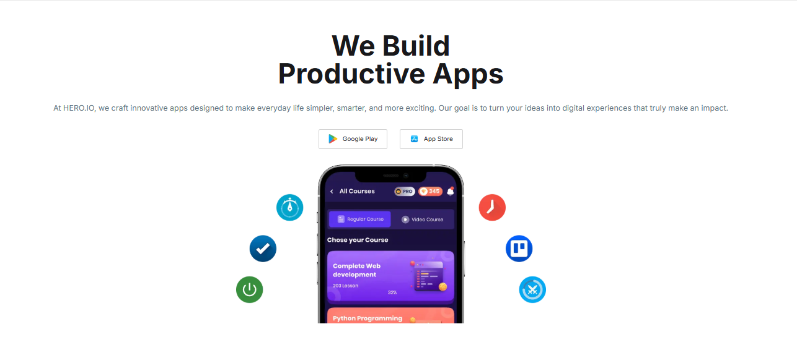

<p align="center">
  
</p>

# Hero IO — App Store Platform

A responsive, feature-rich web application platform built with Next.js for discovering, searching, reviewing, and managing application software seamlessly.

---

## Table of Contents

- [About the Project](#about-the-project)
- [Project Overview](#project-overview)
- [Key Features](#key-features)
- [Tech Stack](#tech-stack)
- [Dependencies](#dependencies)
- [Installation & Setup](#installation--setup)
- [Folder Structure](#folder-structure)
- [Contact](#contact)

---

## About the Project

Hero IO is an intuitive app store interface designed to offer users an easy way to browse trending software, search through catalogs, inspect detailed user review statistics, and maintain a personalized list of installed applications.

---

## Project Overview

Built with modern web technologies including **Next.js (App Router)**, **React**, **TypeScript**, and **Tailwind CSS**, Hero IO provides a fast and mobile-first user experience. The application fetches data dynamically, visualizes star-rating distributions using **Recharts**, and manages state persistence across page visits via React Context and local storage, complete with interactive toast feedback.

This project has been done with a fake api, and the api link is: [API](https://raw.githubusercontent.com/Mahfuz1907/b12-a08-api/master/db.json)

---

## Key Features

- **Trending Apps Showcase** — Clean homepage grid highlighting top trending applications with download counts and rating badges.
- **Search & Filtering System** — Instant real-time app discovery and search across all catalog listings.
- **Dynamic App Details Page** — Detailed application information including interactive rating bar charts powered by Recharts.
- **Local Application Management** — Dynamic "Install / Uninstall" toggles managed via global state with instant notification toasts.
- **Comprehensive Error & Empty States** — Custom visual fallback states for empty installed app lists and missing 404 pages (`not-found.tsx`).

---

## Tech Stack

**Framework & Core:** Next.js (App Router) · React · TypeScript  
**Styling & Design:** Tailwind CSS · Inter Font · Daisy UI
**Data Visualization:** Recharts  
**Icons & Toasts:** Lucide React · React Toastify  
**Tools:** Git · VS Code · npm

---

## Dependencies

List required dependencies or major libraries:

```json
{
  "next": "^16.3.6",
  "react": "^19.0.0",
  "react-dom": "^19.0.0",
  "lucide-react": "^0.475.0",
  "recharts": "^2.15.1",
  "react-toastify": "^11.0.3"
}
```

---

## Installation️ & Setup

1. Clone the repo and install dependencies:

```bash
git clone [https://github.com/Mahfuz1907/b12-a08-api.git](https://github.com/Mahfuz1907/b12-a08-api.git)
cd b12-a08-api
npm install
```

2. Run the application:

```bash
npm run dev
```

---

## Folder Structure

```plaintext
hero-io/
├── Components/
│   ├── Banner/
│   │   ├── Banner.css
│   │   └── Banner.tsx
│   ├── Context/
│   │   └── AppContext.tsx
│   ├── Navbar/
│   │   ├── Navbar.css
│   │   └── Navbar.tsx
│   └── TrendingApps/
│       ├── AppCard.tsx
│       ├── TrendingApps.tsx
│       └── loading.tsx
├── app/
│   ├── apps/
│   │   ├── [id]/
│   │   │   ├── AppReviewChart.tsx
│   │   │   ├── InstallButton.tsx
│   │   │   ├── id.css
│   │   │   ├── not-found.tsx
│   │   │   └── page.tsx
│   │   ├── AllApps.tsx
│   │   ├── AppsAndSearch.tsx
│   │   ├── Search.tsx
│   │   ├── loading.tsx
│   │   └── page.tsx
│   ├── installed/
│   │   ├── AppLists.tsx
│   │   ├── EachApp.tsx
│   │   └── page.tsx
│   ├── globals.css
│   ├── layout.tsx
│   ├── not-found.tsx
│   └── page.tsx
├── public/
│   └── assets/
│       └── webhome.png
├── README.md
└── package.json
```

---

## Contact

**Live URL:** [Live Site](https://b12-a08.vercel.app/)
**Email:** [username](mahfuztamim1907@gmail.com)
**Portfolio:** [Portfolio](https://portfolio-frontend-cv.netlify.app/)
